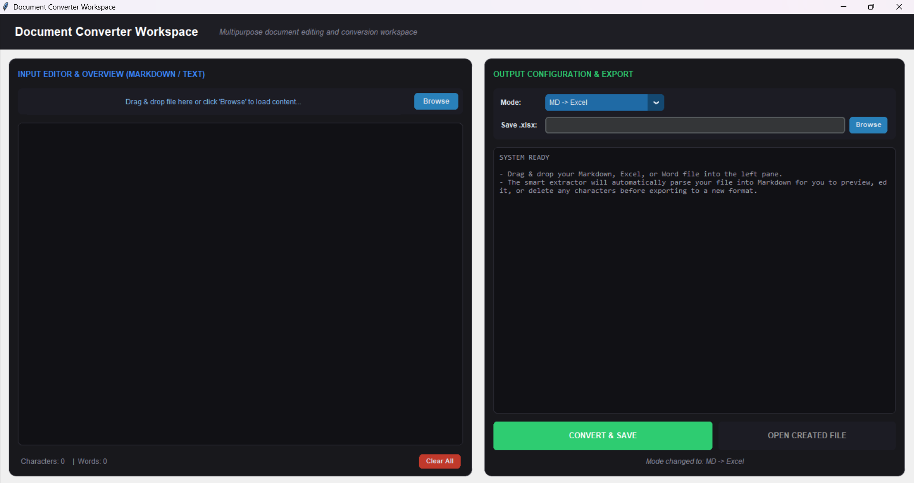

# Document Converter Workspace


A modern desktop workspace for editing and converting documents between **Markdown**, **Excel**, and **Word** formats.

The application provides a unified Markdown-centric workflow, allowing users to extract content from Office documents, edit it in Markdown, and export it back into structured formats.

---

## Screenshot



---

## Features

### Document Conversion

* **Markdown → Excel (.xlsx)**

  * Styled worksheet generation
  * Frozen header row
  * Auto-sized columns
  * Auto-filter support

* **Markdown → Word (.docx)**

  * Heading support
  * Lists support
  * Bold text support
  * Table rendering

* **Excel (.xlsx) → Markdown**

  * Multi-sheet extraction
  * Markdown table generation

* **Word (.docx) → Markdown**

  * Clean document extraction
  * Markdown-friendly formatting

### Workspace Features

* Unified Markdown editor
* Drag & drop file support
* Live content extraction on load
* One-click document opening
* Background-thread conversion pipeline
* Cross-platform support

---

## Supported Formats

| Input          | Output         |
| -------------- | -------------- |
| Markdown (.md) | Excel (.xlsx)  |
| Markdown (.md) | Word (.docx)   |
| Excel (.xlsx)  | Markdown (.md) |
| Word (.docx)   | Markdown (.md) |

---

## Requirements

* Python 3.10+
* Windows
* macOS
* Linux

---

## Quick Start

Clone the repository:

```bash
git clone https://github.com/duyphan1410/DocumentConvertTool
cd DocumentConvertTool
```

Create a virtual environment:

```bash
python -m venv venv
```

Install dependencies:

### Windows

```bash
.\venv\Scripts\pip.exe install -r requirements.txt
```

### macOS / Linux

```bash
./venv/bin/pip install -r requirements.txt
```

Run the application:

### Windows

```bash
.\venv\Scripts\python.exe run.py
```

### macOS / Linux

```bash
./venv/bin/python run.py
```

---

## Alternative: Activate Virtual Environment

### Windows (PowerShell)

```powershell
.\venv\Scripts\Activate.ps1
```

### Windows (CMD)

```cmd
.\venv\Scripts\activate.bat
```

### macOS / Linux

```bash
source venv/bin/activate
```

Then:

```bash
pip install -r requirements.txt
python run.py
```

---

## Drag & Drop

The application supports drag-and-drop input files.

### Supported Behaviors

* Drop a `.md` file to edit it directly.
* Drop a `.docx` file to extract its content into Markdown.
* Drop a `.xlsx` file to extract worksheets into Markdown tables.
* Paths containing spaces or Unicode characters are supported.

---

## Build Executable

### Install PyInstaller

```bash
pip install pyinstaller
```

### Windows Build

```bash
pyinstaller ^
  --onefile ^
  --windowed ^
  --name "Document Converter" ^
  --icon=favicon.ico ^
  run.py
```

Build output:

```text
dist/
```

---

## Project Structure

```text
DocumentConvertTool/
│
├── src/
│   ├── main.py
│   │
│   ├── core/
│   │   ├── extractors.py
│   │   └── converters.py
│   │
│   ├── ui/
│   │   └── app.py
│   │
│   └── utils/
│       └── env.py
│
├── run.py
├── requirements.txt
└── README.md
```

### Directory Overview

| Path                     | Purpose                      |
| ------------------------ | ---------------------------- |
| `src/main.py`            | Application bootstrap        |
| `src/core/extractors.py` | Office → Markdown extraction |
| `src/core/converters.py` | Markdown → Office conversion |
| `src/ui/app.py`          | Main GUI                     |
| `src/utils/env.py`       | Environment helpers          |
| `run.py`                 | Launcher script              |

---

## Dependencies

| Library       | Purpose                  |
| ------------- | ------------------------ |
| customtkinter | Modern UI framework      |
| tkinterdnd2   | Drag & drop support      |
| pandas        | Data processing          |
| openpyxl      | Excel export/import      |
| python-docx   | Word document generation |
| mammoth       | Word document extraction |

---

## Roadmap

### P0 — Stabilization

* [ ] Fix drag & drop path parser
* [ ] File extension validation
* [ ] Overwrite confirmation
* [ ] Dependency fallback handling
* [ ] File size warning

### Phase 1 — UX Improvements

* [ ] Progress indicator
* [ ] Smart table validator
* [ ] CSV ↔ Markdown support
* [ ] Markdown syntax highlighting

### Phase 2 — Format Expansion

* [ ] HTML export engine
* [ ] HTML preview
* [ ] Batch conversion
* [ ] Search & replace panel

### Phase 3 — Advanced Features

* [ ] Resizable window
* [ ] Multi-document tabs
* [ ] PDF export
* [ ] Conversion presets
* [ ] Plugin / converter API

---

## Development

Recommended branch strategy:

```text
main
├── fix/p0-stabilization
├── feature/progress-api
├── feature/html-export
└── feature/plugin-system
```

Commit example:

```bash
git commit -m "feat: add html export engine"
git commit -m "fix: improve drag drop parser"
```

---

## Contributing

Contributions are welcome.

Before opening a Pull Request:

1. Follow PEP 8 conventions.
2. Add type hints to new APIs.
3. Test conversion workflows.
4. Keep UI responsive during long-running operations.

---

## License

MIT License

You are free to use, modify, distribute, and build upon this project under the terms of the MIT License.
